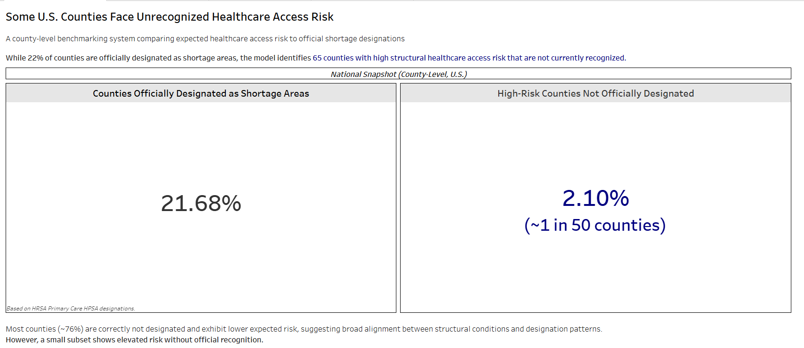
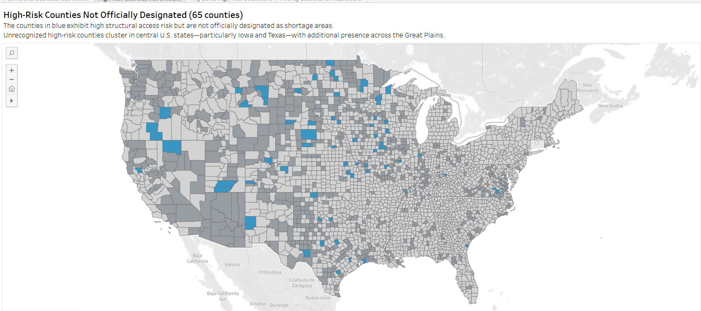
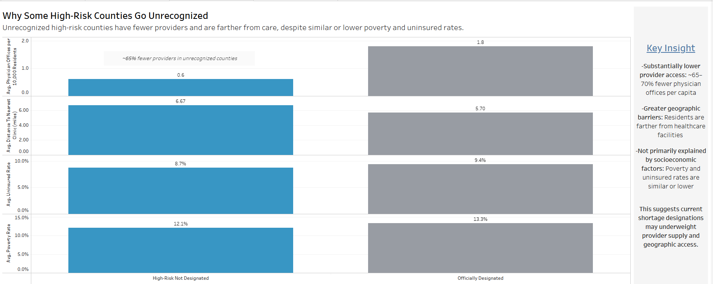

# Unrecognized Healthcare Access Risk Benchmarking & Intervention Prioritization

## Overview

This project identifies U.S. counties with high healthcare access risk that are not currently captured by official Health Professional Shortage Area (HPSA) designations.

Using a county-level predictive model, expected healthcare access risk is estimated based on structural factors such as provider availability, geographic access, and population characteristics. These model-based expectations are then compared to official designation status to identify gaps between expected need and formal recognition.

---

## Key Findings

- ~22% of U.S. counties are officially designated as healthcare shortage areas  
- The model identifies **65 counties (~1 in 50 counties nationwide) with high access risk that are not officially designated** as shortage areas
- Many top-priority counties exhibit extremely limited physician office availability and above-average geographic distance to care. A prioritization framework was developed to support review and intervention targeting under resource constraints

---
## Dashboard

[Tableau Public Dashboard Here](https://public.tableau.com/app/profile/precious.o.enahoro/viz/U_SHealthcareAccessGapIndexHAGI/SomeU_S_CountiesFaceUnrecognizedHealthcareAccessRisk)

The Tableau dashboard includes:

- **Overview:** National comparison of expected risk vs. designation  
- **Map:** Geographic distribution of unrecognized high-risk counties  
- **Drivers:** Key structural differences between recognized and unrecognized counties  
- **Priority Counties:** Actionable list of counties for potential intervention  

### Dashboard Preview

---

## Core Insight

Unrecognized high-risk counties differ from officially designated areas in meaningful ways:

- **Lower provider access:** ~65–70% fewer physician offices per capita  
- **Greater geographic barriers:** Residents are farther from healthcare facilities  
- **Not primarily explained by socioeconomic factors:** Poverty and uninsured rates are similar or lower  

This suggests that current designation frameworks may underweight provider supply and geographic access—highlighting an opportunity for more data-driven, nationally scalable approaches to identifying underserved areas.

---

## National Relevance

This project demonstrates how publicly available data can be used to identify gaps in healthcare access at a national scale.

By comparing expected access risk to official shortage designations, the framework provides a systematic way to surface underserved areas that may not be captured by existing criteria. Such approaches can support more data-informed resource allocation, policy evaluation, and early identification of underserved communities across the U.S. healthcare system.

---

## Methodology

1. **Data Integration**  
   County-level healthcare, demographic, and access-related datasets were combined and standardized using FIPS identifiers.

2. **Modeling**  
   A classification model (XGBoost) was trained to estimate expected healthcare access risk based on structural features such as provider availability, infrastructure, and geographic access.  
   Model performance achieved an AUC of approximately **0.79**.

3. **Benchmarking**  
   Predicted risk was compared to official HPSA designation status to identify misalignment.

4. **Classification**  
Counties are classified based on predicted risk and official designation:

- **High-Risk Not Designated:** High predicted access risk without official shortage designation  
- **Officially Designated:** Counties currently identified as shortage areas  
- **Not Designated (Lower Expected Risk):** Counties with lower predicted risk and no designation  

5. **Analysis**  
   Geographic patterns and structural drivers were analyzed to understand differences between recognized and unrecognized high-risk areas.

The approach is designed to be extensible to other domains where structural risk and official designation may diverge.

---
## Intervention Prioritization Framework

In addition to identifying counties with elevated structural healthcare access risk, the project includes a prioritization framework designed to support resource allocation and intervention review.

High-risk counties without official shortage designation are ranked using a composite priority score incorporating:

- Expected healthcare access risk
- Physician office availability
- Distance to nearest clinic
- Population scale

The framework highlights counties where structural access barriers may warrant additional review of provider capacity and shortage designation status.

This extension shifts the project from descriptive benchmarking toward actionable decision support for healthcare access planning and prioritization.

---
## Example Use Cases

This framework can support:

- Data-informed resource allocation  
- Evaluation of existing designation frameworks  
- Identification of underserved regions not captured by current criteria  
- Early detection of emerging access challenges  

---

## Tools & Technologies

- **Python:** scikit-learn, XGBoost  
- **SQL:** Data integration and transformation  
- **Tableau:** Visualization and dashboard development  

---

## Notes

- Alaska and U.S. territories were excluded from the final analysis for comparability  
- Results are based on publicly available data and model assumptions  

---

## Future Improvements

- Incorporate additional provider capacity and utilization metrics  
- Refine geographic access measures (e.g., travel time vs. distance)  
- Extend the framework to other healthcare domains and outcomes  

---

## Final Positioning

This project presents a nationally relevant analytical framework for identifying gaps between expected healthcare access risk and official shortage designations.
It demonstrates how publicly available data and predictive modelling can support more data-informed, scalable approaches to identifying underserved communities across the U.S. healthcare system.
